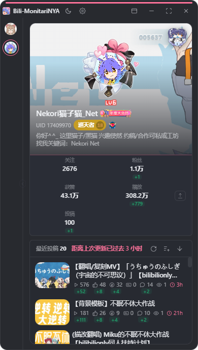
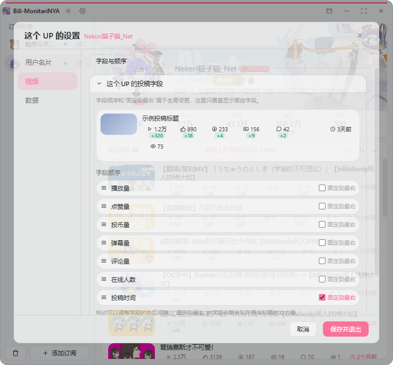

# Bili-MonitariNYA

**Bili 监视姬** —— 一个适合常驻桌面的 Bilibili UP 主数据查看工具。

把常看的 UP 主放进一个小窗口里，随时查看资料、粉丝 / 获赞 / 播放 / 投稿数据、近期投稿和一段时间内的变化，不需要来回打开多个空间页。

支持多 UP 订阅、Bilibili 扫码登录、个性化字段显示、明暗主题、托盘后台运行和应用内更新。

<p align="center">
  
</p>

<p align="center">
  <a href="https://github.com/Nekori347/Bili-MonitariNYA/releases/latest"><b>下载最新版</b></a>
  ·
  <a href="https://github.com/Nekori347/Bili-MonitariNYA/releases">历史版本</a>
  ·
  <a href="./DEVELOPMENT.md">开发说明</a>
</p>

## 能做什么

- **同时关注多个 UP 主**  
  通过 UID 或空间链接添加订阅，在侧栏里快速切换。

- **把空间资料集中在一张卡片里**  
  查看头像、Banner、简介、等级、大会员、认证、粉丝牌、头像挂件、空间装扮，以及关注、粉丝、获赞、播放、投稿等数据。

- **查看近期投稿，不必逐个点进空间**  
  直接浏览封面、标题、发布时间、播放、点赞、投币、弹幕、评论和当前在线观看等信息。

- **记录一段时间内的数据变化**  
  本地保存历史快照，在数据有变化时显示增长情况。

- **按自己的习惯决定界面显示什么**  
  用户名片和视频信息都可以单独开关；视频字段可调整顺序，并可固定一个字段到最右侧。

- **适合窄窗口长期放在桌面边缘**  
  支持侧栏收起、窗口置顶、鼠标穿透、托盘后台运行，以及明亮 / 深色 / 跟随系统主题。

- **本地缓存，切换订阅更快**  
  已查看过的资料和图片会保留本地缓存；设置页可以查看总缓存与单个订阅的缓存占用。

## 界面

<p align="center">
  
  &nbsp;&nbsp;
  
</p>

<p align="center">
  
</p>

## 下载与安装

前往 [Releases](https://github.com/Nekori347/Bili-MonitariNYA/releases/latest) 下载最新版本：

```text
Bili-MonitariNYA_<版本号>_x64-setup.exe
```

运行安装包即可。

Bili-MonitariNYA 目前面向 Windows 桌面环境。

## 快速开始

1. 打开软件，点击侧栏底部的「＋ 添加订阅」。
2. 输入 Bilibili 用户 UID，或粘贴 `space.bilibili.com/{mid}` 空间链接。
3. 从左侧头像列表切换不同 UP 主。
4. 点击设置，可以调整用户名片、视频字段、主题、窗口行为、缓存和更新选项。

## Bilibili 登录

不登录也可以使用基础功能。

部分资料与统计需要登录态时，可以在：

**设置 → 系统 → B 站账号**

使用 Bilibili 手机客户端扫码登录。

登录凭据只保存在本机，并由 Windows 加密保护；软件不会把你的 Bilibili Cookie 上传到第三方服务器。

## 数据与隐私

订阅、备注、设置、历史记录和缓存均保存在本机。

Bili-MonitariNYA 不提供云同步，也不会建立独立账号系统。

卸载或更新程序时，用户数据与程序文件是分开的；正常版本更新不会清空已有订阅和历史数据。

## 自动更新

软件支持从 GitHub Releases 检查新版本。

你也可以随时在：

**设置 → 系统 → 自动更新**

手动检查更新，或直接从本仓库 Releases 下载最新版。

## 说明

- Bili-MonitariNYA 是第三方工具，与哔哩哔哩官方无隶属关系。
- 数据来自 Bilibili 当前可访问的公开 / 登录态接口，接口变化可能导致个别字段暂时不可用。
- 本项目专注于 UP 主资料、投稿与数据变化查看，不包含播放器、视频下载、评论区客户端或动态流替代功能。

## 开发

项目使用 Tauri 2 + React + TypeScript 构建。

如果你想自己构建、提交修改或了解项目结构，请查看：

- [DEVELOPMENT.md](./DEVELOPMENT.md)
- [发布流程](./scripts/RELEASE.md)

欢迎通过 Issue / Pull Request 提交问题与改进。

## 许可证

本项目使用 [GNU General Public License v3.0](./LICENSE)（GPL-3.0）。

Copyright (C) 2026 Nekori猫子猫_Net
